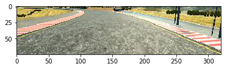
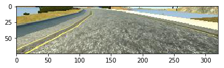
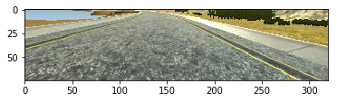
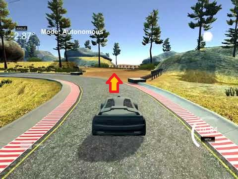

# **Behavioral Cloning - Project Writeup** 

## Project goals

The goals / steps of this project are the following:
* Use the simulator to collect data of good driving behavior
* Build, a convolution neural network in Keras that predicts steering angles from images
* Train and validate the model with a training and validation set
* Test that the model successfully drives around track one without leaving the road
* Summarize the results with a written report

## Main results

The car learned to successfully drive around the first track at 15mph using [MobileNet](https://arxiv.org/pdf/1704.04861.pdf) architecture!

[](https://www.youtube.com/watch?v=EbwU391KmlQ)

My project includes the following files:

* [model.py](model.py) containing the script to create and train the model. Generator wasn't used because there was enough RAM to fit the training data (~10GB).
* [drive.py](drive.py) for driving the car in autonomous mode
* [model.h5](model.h5) containing a trained MobileNet convolution neural network 
* [video.mp4](video.mp4) containing test video as recorded by `drive.py`

The car can be driven autonomously around the track by executing 
```sh
python drive.py model.h5 15
```

## Data preparation

The critical part of this project was to prepare appropriate training data by driving manually in the simulator and then pre-processing it. Since the "test data" is ultimately generated by the autonomous driving of the model itself, it is quite a challenge to make the training data a "representative sample" of the test data. For example, if the model veers of the road while driving, and it has never seen off-road training data, then there is no way for it to know what to do.

### Driving the simulator

I genereted the training data for the model by driving 3 laps very carefully following the center of the road at low speed. I used mouse for fine-grained steering, so as to generate smooth steering angles.

I fully expected to need more training data, recording how the car should recover from dangerous positions, but, surprisingly, the model learned to drive even without that! I suspect the data from left and right cameras was enough of a substitute.

### Validation

I split the data into:

* 2 laps for training data
* 1 lap for validation data
* No testing data, since the test is how well it actually drives, which is impossible to replicate with a dataset.

Note that I didn't select validation data by random sampling from all 3 laps, because that would yield closely time-correlated data samples, and wouldn't actually help overfitting.

### Pre-processing

Given the 2 laps of training data, following data preparation steps were performed:

* The images were cropped 60 pixels from above to remove the scenery which might lead to overfitting
* The images were cropped 30 pixels from below to remove the car model
* Flipped images were generated with flipped steering angles
* Left and right camera images were added with 0.1 steering correction. This compensates for the lack of driving data where car recovers from driving to the left or to the right of the center.

Only cropping was applied to the validation data. Here are examples of the cropped images:





In the end the data consisted of:

* 41892 training images (6982 frames, generated x6)
* 3695 validation images

## Training the model

### Architecture

#### LeNet & Nvidia

I first tried [LeNet](https://github.com/jurgisp/CarND-Traffic-Sign-Classifier-Project#model-architecture) architecture and [Nvidia](https://devblogs.nvidia.com/deep-learning-self-driving-cars/) architecture - both performed OK, but didn't drive the full lap - they would leave the track onto the dirt road. Understandably, that's a tricky place - the side of the road is not as clearly distinguished.



#### MobileNet

Then I decided to try a more complex architecture. I didn't feel like taking up the challenge and desigining it myself, since people spent years doing that already. In the spirit of transfer learning that we saw in the lectures, I looked at the [available network architectures in Keras](https://keras.io/applications/#documentation-for-individual-models). Since we needed a fast and small network, to be able to classify many frames per second, I picked [MobileNet](https://arxiv.org/pdf/1704.04861.pdf). 

### Training

I didn't use pre-trained weights of MobileNet from ImageNet for two reasons: it's trained on 224x224 images while we have 70x320, and the images are actually very different.

So I trained MobileNet (with top layer replaced) from randomly initialized weights over 10 epochs using Adam optimizer. It took about 50 minutes on an AWS `p2.xlarge` instance (NVIDIA K80 GPU). Here is the training log:

```
Train on 41892 samples, validate on 3695 samples
Epoch 1 - 299s - loss: 0.0257 - val_loss: 0.0086
Epoch 2 - 294s - loss: 0.0039 - val_loss: 0.0102
Epoch 3 - 294s - loss: 0.0025 - val_loss: 0.0136
Epoch 4 - 294s - loss: 0.0019 - val_loss: 0.0044
Epoch 5 - 294s - loss: 0.0016 - val_loss: 0.0064
Epoch 6 - 294s - loss: 0.0014 - val_loss: 0.0061
Epoch 7 - 294s - loss: 0.0012 - val_loss: 0.0027
Epoch 8 - 293s - loss: 0.0011 - val_loss: 0.0085
Epoch 9 - 294s - loss: 0.0013 - val_loss: 0.0015
Epoch 10 - 294s - loss: 9.9142e-04 - val_loss: 0.0016
 ```

 We can see from validation loss, that the model doesn't overfit.

## Autonomous driving

And it worked!!! The MobileNet model drove the whole lap! At first I ran with 9mph speed as was initially hardcoded, but then I increased it to 15mph, and it was still good. 

A note on performance of the network: when I tried to run `drive.py` on my laptop without a GPU, MobileNet prediction would take ~100ms per frame, which was actually too slow for driving. I then set it up to run on the same AWS instance with a GPU, which could do prediction in <10ms, which was fast enough.
